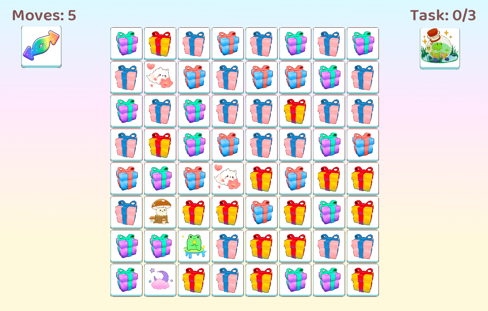

Match blast

Genre: Puzzle

Description:
This game is a classic match-3 puzzle where players swap adjacent tiles on a grid to merge and match three tiles of the same color in a row or column. The game involves strategic thinking, as players must carefully manage limited moves to achieve specific goals within each level.

2. Game Flow

Start:

The game begins with a 2D grid (8x8) filled with randomly generated colored tiles.
The player is presented with the current level’s objective, which typically involves matching a certain number of tiles of a specific color.
The player starts with a set number of moves (e.g., 30 moves).

Game Process:

Tile Selection and Swapping: The player clicks on a tile to select it and then clicks on an adjacent tile to swap their positions. Tiles can only be swapped if they create a valid match or merge of three in a row or column.
Tile Matching: When a match of three or more tiles is made, the matched tiles are marked for deletion. If special conditions are met, such as matching specific tiles required by the task, additional effects (like sounds and animations) are triggered.
Tile Deletion and Gravity: Matched tiles disappear, and the tiles above them drop down to fill the empty spaces. New tiles are generated at the top of the grid to fill any remaining gaps.
Task Management: Players are given specific tasks to complete each level. This is managed by the TaskManager system, which tracks progress and determines when the task is complete.
Move Management: Each move decreases the move counter. The player must complete the task before running out of moves.
Game Over Conditions:

Game Over: If the player runs out of moves before completing the task, the game ends, displaying a "Game Over" screen.
Game Won: If the player completes the task within the allowed moves, they win the game, and a "Congratulations" screen is displayed.
Game Interruptions:

The game can be paused or exited by pressing the "Escape" key.
The game can be restarted by pressing the "R" key after a game over or winning condition.
3. Game Mechanics
Tile Matching or blasting (depends on the level of merge):

Players create matches by swapping two adjacent tiles. Matches can be horizontal or vertical lines of three or more tiles.
When a match is made, the handleMerging function is called to manage the merging process and trigger the appropriate animations and sounds.
Task Management:

Players are given specific tasks to complete each level, such as matching a certain number of tiles of a specific color. The TaskManager system tracks the player’s progress and updates the game status accordingly.
Reshuffling:

If no matches are possible, or the player is stuck, they can reshuffle the grid. The reshuffleGrid function randomly rearranges all tiles on the board and plays a reshuffling sound.
Sound Management:

The game features sound effects for different actions, such as tile swapping, merging, and reshuffling, managed by the SoundManager system.
UI Elements:

Moves Counter: Displays the remaining number of moves.

Task Display: Shows the current level’s task and progress.
4. Technical Systems
Grid System:

The core of the game is an 8x8 grid, represented as a 2D array of pointers to Tile objects. Each tile has properties such as row, column, type (color), and alpha (for transparency).
Tile System:

Tile Types: The game features four types of tiles: Red, Blue, Green, and Yellow, each represented by a class (RedTile, BlueTile, etc.).
Tile Behavior: Tiles can be swapped, merged, and deleted. The merging process includes animation and sound effects.
Task Management:

TaskManager: This system manages the level objectives, tracks progress, and updates the game state based on the player’s performance.
Sound Management:

SoundManager: Manages all sound effects in the game, such as the sounds for merging tiles, clicking, and reshuffling. It ensures that the appropriate sound is played for each action.
UI:

Moves Text: Displays the remaining moves, updated in real-time as the player makes swaps.
Shuffle Button: A UI element that allows the player to reshuffle the grid, positioned and scaled for easy access.
Task Display: The current objective is displayed to the player using text and images, managed by the TaskManager.
Input Handling:

The game captures mouse input for tile selection and swapping, and keyboard input for game control (e.g., restarting the game, exiting).
Animation System:

The game includes basic animations for tile movements and merging. The movement is calculated in small increments to simulate smooth transitions.
Game States:

The game maintains different states such as active play, game over, game won, and reshuffling, each managed by specific logic in the game loop.
Resource Management:

Textures and Fonts: The game loads necessary resources like textures and fonts at the start and manages them throughout the game.