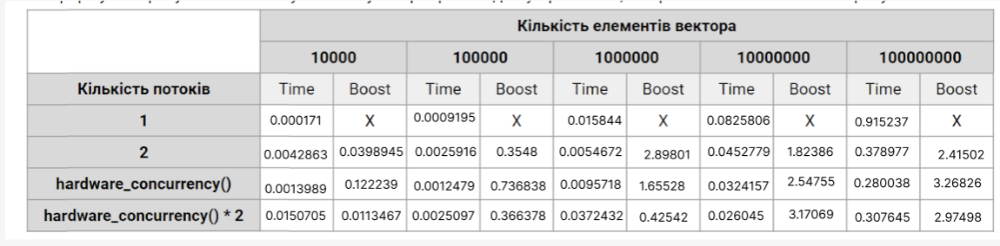

This table shows that for larger vectors, the use of multiple threads significantly improves performance, especially when using 4 threads. However, for smaller vectors (like 10,000 elements), the overhead of managing multiple threads often outweighs the benefits, leading to worse performance with more threads.