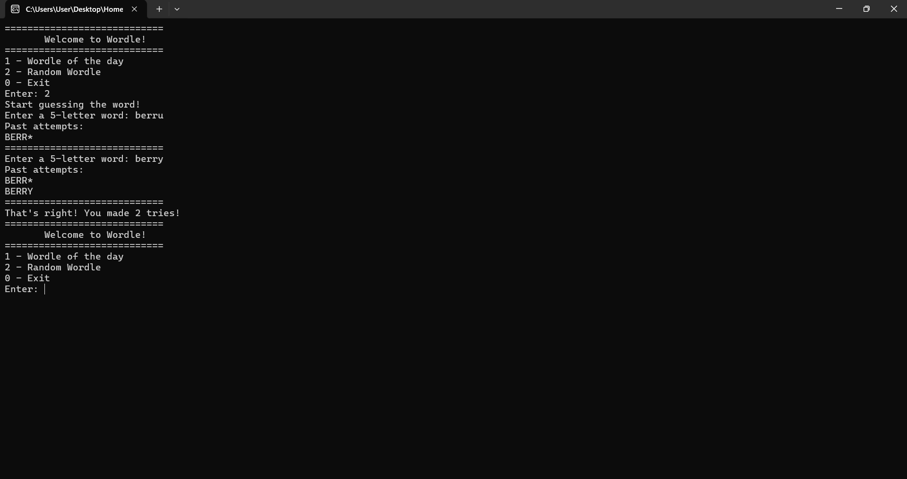

# Wordle

## Description

This program is a console-based implementation of the popular "Wordle" game. The objective of the game is to guess a 5-letter word that the program generates randomly or selects as the "word of the day". The user inputs 5-letter words and receives feedback on the accuracy of the entered word.

## Algorithm Explanation

1. **Loading Words from Database:**
   - The function `loadDatabase` reads words from a text file and stores them in a vector.

2. **Generating the Word of the Day:**
   - The function `getWordOfTheDay` selects a word based on the current date.
   - The function `saveWordOfTheDay` saves the selected word to a file.
   - The function `loadWordOfTheDay` loads the word from the file if it exists.

3. **Comparing Words:**
   - The function `compareWords` compares the guessed word with the secret word and provides feedback using uppercase, lowercase letters, and asterisks.

4. **Main Game Loop:**
   - The main function handles user input, calls the comparison function, and tracks the number of attempts.

## Test Cases

### Covered Test Cases

1. **Basic Functionality:**
   - Enter a 5-letter word and receive correct feedback.
   - Example: Secret word is "APPLE", user enters "apple", receives "APPLE".
   

2. **Handling Different Cases:**
   - Correct letter in the wrong position is shown as a lowercase letter.
   - Example: Secret word is "GAMER", user enters "GAMRE", receives "GAMre".
   

3. **Invalid Input:**
   - Ensuring only 5-letter words are accepted.
   - Example: User enters "BERR", program prompts for a valid 5-letter word.
   

4. **Word of the Day:**
   - The word of the day remains consistent across sessions on the same day.
   

### Uncovered Test Cases

1. **Handling Duplicates:**
   - Correctly handling words with duplicate letters.
   - Example: Secret word is "BERRY", user enters "berru", receives "BERR*".
   

2. **Multiple Users:**
   - Ensuring the word of the day is the same for multiple users on the same day.
